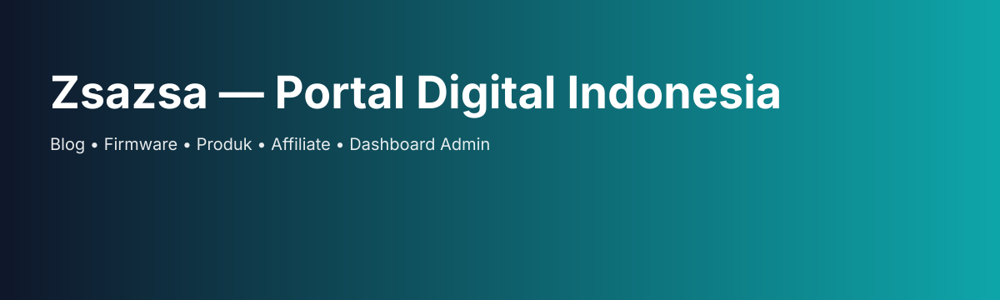

# Zsazsa Blog



Portal digital modern berbahasa Indonesia untuk blog, firmware, produk, affiliate, dan dashboard admin.

[](https://zsazsa.example) [](LICENSE)

## Ikon
<p>
	
</p>

## Fitur utama
- Blog SEO lengkap
- Firmware dan sistem download
- Produk, toko, stok, dan marketplace
- Affiliate, komisi, dan tracking
- Dashboard admin modern
- Integrasi WhatsApp, Telegram, QRIS, COD, dan pembayaran digital

## Jalankan lokal
```bash
npm install
npm run dev
```

Atau dengan Docker:
```bash
docker compose up --build
```

Akses di http://localhost:3000
